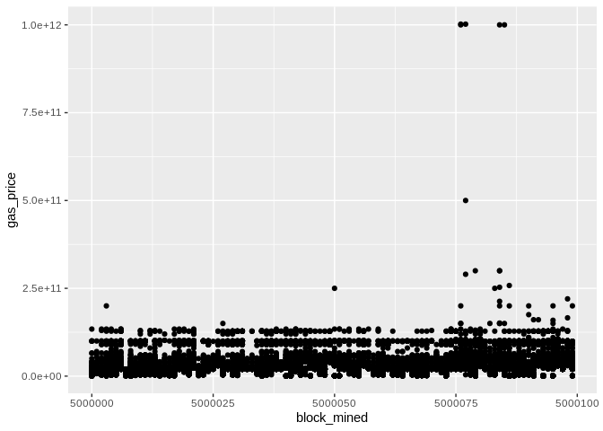
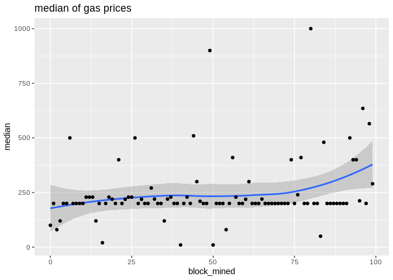

[](https://hackmd.io/c6kyRNMuTnKf_SlolmevRg)

As discussed in EIP-1559, users have to pay a basefee that will be burned for each transaction. Basefee is updated with a multiplication rule derived from the size of the last block. If the last block size is more than the target size, basefee will increase, and if the last block is not full, basefee will decrease.

We will simulate the basefee parameter in EIP-1559 and show in a world with only 5% rationality, basefee would decrease to 0.
Then we are going to show that an additive equation for updating basefee would solve this problem.

First, we implement a class for transactions.

``` python
import secrets
%config InlineBackend.figure_format = 'svg'

class Transaction:
    def __init__(self, gas_premium, fee_cap, gas_used,waiting_limit):
        self.gas_premium = gas_premium
        self.fee_cap = fee_cap
        self.gas_used = gas_used
        self.tx_hash = secrets.token_bytes(8)
        self.waiting_limit = waiting_limit
        self.sent_to_memepool = False
        
    def __lt__(self, other):
        return self.gas_premium < other.gas_premium 
```

Then we import some libraries.

``` python
import pandas as pd

# cadCAD configuration modules
from cadCAD.configuration.utils import config_sim
from cadCAD.configuration import Experiment

# cadCAD simulation engine modules
from cadCAD.engine import ExecutionMode, ExecutionContext
from cadCAD.engine import Executor
```

We Declare some constants.

``` python
constants = {
    "BASEFEE_MAX_CHANGE_DENOMINATOR": 8,
    "TARGET_GAS_USED": 12500000,
    "MAX_GAS_EIP1559": 25000000,
    "INITIAL_BASEFEE": 1 * (10 ** 9),
}
```

Here we declare a demand function that generates new transactions for each block. In this simulation we assume only 5% of population can wait for at least for 10 blocks and other transactions will be sent immediately after creation.


We can simply see that a rational choice for a user is that if user thinks basefee is going to increase, he should send transaction immediately and if basefee is going to decrease, it is better for him to wait for at least one block. 

``` python
from random import randint

def update_demand_variable(params, step, sL, s, _input):
    # dict of transactions as a demand
    demand = s["demand"]
    latest_block = s["latest_block"]
    
    # adding new transactions
    for i in range(500):
        gas_premium = randint(1, 10) * (10 ** 10)
        fee_cap = gas_premium + randint(1, 10) * (10 ** 9)
        waiting_limit = 10*(randint(1, 100)<5)
        tx = Transaction(
            gas_premium = gas_premium,
            gas_used = 25000,
            fee_cap = fee_cap,
            waiting_limit = waiting_limit
        )
        demand[tx.tx_hash] = tx
        
    for tx in latest_block.txs:
        demand.pop(tx.tx_hash)
    
    # estimation of next block size
    basefee = s["basefee"]
    miner_gains = 0
    txs_included = []
    
    for tx_hash, tx in demand.items():
        if not is_valid(tx, basefee):
            continue
        if not tx.sent_to_memepool:
            continue
        gas_price = min([basefee + tx.gas_premium, tx.fee_cap])
        miner_gains += (gas_price - basefee) * tx.gas_used
        txs_included += [tx]
        
    gas_used = sum([tx.gas_used for tx in txs_included])
    is_full = gas_used > 0.5*constants["TARGET_GAS_USED"]
    
    # send transactions and update waiting limit
    for tx_hash, tx in demand.items():
        if tx.waiting_limit == 0 or is_full:
            tx.sent_to_memepool = True
        if tx.waiting_limit>0:
            tx.waiting_limit = tx.waiting_limit-1
        
    return ("demand", demand)
```

Declaring a block and a function to check validity of transactions.

``` python
class Block():
    def __init__(self, txs):
        self.txs = txs
        
def is_valid(tx, basefee):
    return tx.fee_cap >= basefee
```

This function is going to include valide transactions in the next block.

``` python
def include_valid_txs(params, step, sL, s):
    demand = s["demand"]
    basefee = s["basefee"]
    miner_gains = 0
    txs_included = []
    
    for tx_hash, tx in demand.items():
        # include valid transactions
        if not is_valid(tx, basefee):
            continue
        # include sent transactions
        if not tx.sent_to_memepool:
            continue
        
        
        gas_price = min([basefee + tx.gas_premium, tx.fee_cap])
        miner_gains += (gas_price - basefee) * tx.gas_used
        txs_included += [tx]
        
    assert miner_gains >= 0
    return ({ "block": Block(txs = txs_included) })
```

Update basefee after each block as mentioned in EIP-1559.

``` python
def update_basefee(params, step, sL, s, _input):
    block = _input["block"]
    basefee = s["basefee"]
    
    gas_used = sum([tx.gas_used for tx in block.txs])
    delta = gas_used - constants["TARGET_GAS_USED"]
    new_basefee = basefee + basefee * delta / constants["TARGET_GAS_USED"] / constants["BASEFEE_MAX_CHANGE_DENOMINATOR"]
    
    return ("basefee", new_basefee)
```

Save last black in results.

``` python
def record_latest_block(params, step, sL, s, _input):
    block = _input["block"]
    
    return ("latest_block", block)
```

Run simulation and save results in a dataFrame.

``` python
%%capture
from cadCAD import configs

psub = [{
    "policies": {},
    "variables": {
        "demand": update_demand_variable # step 1
    }
}, {
    "policies": {
        "action": include_valid_txs # step 2
    },
    "variables": {
        "basefee": update_basefee, # step 3
        "latest_block": record_latest_block
    }
}]

initial_conditions = {
    "basefee": constants['INITIAL_BASEFEE'],
    "demand": {},
    "latest_block": Block(txs=[])
}

del configs[:]

simulation_parameters = config_sim({
    'T': range(10000),
    'N': 1
})

experiment = Experiment()
experiment.append_configs(
    initial_state = initial_conditions,
    partial_state_update_blocks = psub,
    sim_configs = simulation_parameters
)

exec_context = ExecutionContext()
simulation = Executor(exec_context=exec_context, configs=configs)
raw_result, tensor, sessions = simulation.execute()
df = pd.DataFrame(raw_result)

```

In this plot we show basefee as time passes. We can see basefee is not stable and decreases with time.

``` python
import seaborn as sns
import matplotlib.pyplot as plt

sns.set(style="whitegrid")
df[50:][df.substep == 1].plot('timestep', ['basefee'])
```

Now assume a user with a considerable number of transactions (like an exchange) wants to manipulate the basefee. He can easily do so with just sending all of his transactions in a full block and not sending any transactions in blocks with size below target size. This action would make basefee to decrease over time and converge to zero. We have to incentivize such users to smoothly send their transactions instead of sending them in bulks.

Problem of sending a large number of transactions is equivalent to problem of liquidating a large portfolio as discussed in ["Optimal Execution of Portfolio Transactions"](https://pdfs.semanticscholar.org/3d2d/773983c5201b58586af463f045befae5bbf2.pdf) and as it is shown in that paper, with an additive cost function the trader's optimal choice is to distribute the transactions across in time. So if we update basefee with an additive function, users optimal choice is to send transactions in all blocks.

In this section we change update_basefee function.

``` python
def update_basefee(params, step, sL, s, _input):
    block = _input["block"]
    basefee = s["basefee"]
    
    gas_used = sum([tx.gas_used for tx in block.txs])
    delta = gas_used - constants["TARGET_GAS_USED"]
    new_basefee = basefee + delta / constants["TARGET_GAS_USED"] / constants["BASEFEE_MAX_CHANGE_DENOMINATOR"]
    
    return ("basefee", new_basefee)
```

Run simulation with new update rule. 

``` python
%%capture
from cadCAD import configs

psub = [{
    "policies": {},
    "variables": {
        "demand": update_demand_variable # step 1
    }
}, {
    "policies": {
        "action": include_valid_txs # step 2
    },
    "variables": {
        "basefee": update_basefee, # step 3
        "latest_block": record_latest_block
    }
}]

initial_conditions = {
    "basefee": constants['INITIAL_BASEFEE'],
    "demand": {},
    "latest_block": Block(txs=[])
}

del configs[:]

simulation_parameters = config_sim({
    'T': range(10000),
    'N': 1
})

experiment = Experiment()
experiment.append_configs(
    initial_state = initial_conditions,
    partial_state_update_blocks = psub,
    sim_configs = simulation_parameters
)

exec_context = ExecutionContext()
simulation = Executor(exec_context=exec_context, configs=configs)
raw_result, tensor, sessions = simulation.execute();
df2 = pd.DataFrame(raw_result)
```

And finally plot two plots together.

``` python
df.merge(df2,on=['timestep','subset','simulation','run','substep'],suffixes=('_multiplication','_additive'))[df.substep == 1][50:].plot('timestep', ['basefee_multiplication','basefee_additive'])
```


We first download the data from the Ethereum blockchain.

``` python
import pandas as pd
import numpy as np
from web3 import Web3, HTTPProvider


web3 = Web3(HTTPProvider('http://localhost:8545'))

    
class CleanTx():
    """transaction object / methods for pandas"""
    def __init__(self, tx_obj):
        self.hash = tx_obj.hash
        self.block_mined = tx_obj.blockNumber
        self.gas_price = tx_obj['gasPrice']
        self.round_gp_10gwei()
        
    def to_dataframe(self):
        data = {self.hash: {'block_mined':self.block_mined, 'gas_price':self.gas_price, 'round_gp_10gwei':self.gp_10gwei}}
        return pd.DataFrame.from_dict(data, orient='index')

    def round_gp_10gwei(self):
        """Rounds the gas price to gwei"""
        gp = self.gas_price/1e8
        if gp >= 1 and gp < 10:
            gp = np.floor(gp)
        elif gp >= 10:
            gp = gp/10
            gp = np.floor(gp)
            gp = gp*10
        else:
            gp = 0
        self.gp_10gwei = gp


block_df = pd.DataFrame()
for block in range(5000000, 5000100, 1):
    block_obj = web3.eth.getBlock(block, True)
    for transaction in block_obj.transactions:
        clean_tx = CleanTx(transaction)
        block_df = block_df.append(clean_tx.to_dataframe(), ignore_index = False)
block_df.to_csv('tx.csv', sep='\t', index=False)
```

Before we begin, some plots from the raw data (gas price will be normalized later):



Now, we throw out the `round_gp_10gpwei` column and divide the `gas_price` by 10<sup>8</sup>. Then we group our gas prices data by the blocks and we compute a summary (`min,median,mean,max`). The blocks are consecutive and their numbers are made to start from zero in order to have a bit more visually appealing plots!

Here are some plots. `geom_smooth()` uses by default the Local Regression (`loess` for short):

*Loess Regression is the most common method used to smoothen a volatile time series. It is a non-parametric methods where least squares regression is performed in localized subsets, which makes it a suitable candidate for smoothing any numerical vector.*

To show the effectiveness/stability of median over other methods, we plot the data points along with the prediction curve of each (`min,median,mean,max`). Notice the scale of `max` is quite different therefore, although it seems stable its prediction curve has much higher errors than median. See the last two plots to compare the scale of their fluctutations.




Here is the max, median, and min statistics summary plot:


Here is how the mean and median and minimum curves compare:


Here is how all curves compare:


<!-- Let us see how the method `gam` errors compare in each case: -->
<!-- Here you will first need to normalized each column to make this meaningful -->
<!-- ```{r} -->
<!-- gam.med <- gam(min_gas_price~block_mined,data=tx.summary) -->
<!-- gam.med$deviance -->
<!-- ``` -->
